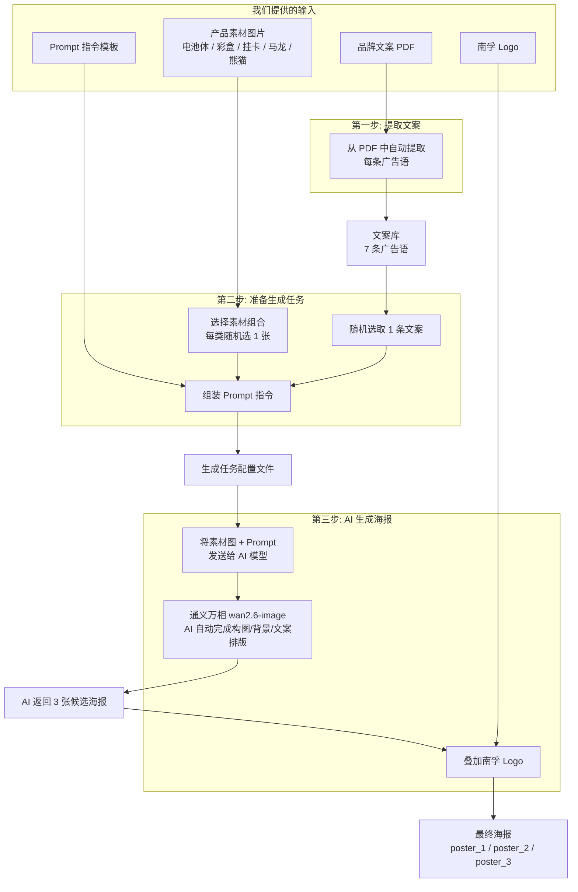

# 南孚电池 AI 电商海报生成系统

## 项目简介

本项目为南孚电池打造了一套 **AI 自动生成电商海报** 的工作流。只需提供产品素材图片（电池体、彩盒、挂卡、代言人马龙、出海熊猫等）和品牌文案，系统会自动将它们交给阿里通义万相 AI 模型（wan2.6-image），由 AI 一次性完成海报的构图、背景设计、光影处理和文案排版，最终输出可直接用于电商平台的主图商详和投放素材。

每次生成 **3 张候选海报**，尺寸为 **800 x 800 像素**，从中挑选最满意的即可使用。

---

## 整体流程



---

## 输入素材

所有输入素材存放在 `Input Component/` 文件夹中：

### 产品素材图片（6 类）

| 素材类型 | 说明 | 适用场景 |
|----------|------|----------|
| 电商彩盒 | 国内版产品包装盒图 | 国内电商 |
| 电池体 | 国内版单节电池图（5号/7号） | 国内电商 |
| 挂卡 | 挂卡形态产品图 | 国内电商 |
| 马龙 | 品牌代言人马龙的形象照 | 国内电商 |
| 出海电池体 | 出海版单节电池图 | 海外电商 |
| 出海熊猫 | NANFU 出海品牌的熊猫形象 | 海外电商 |

### 其他输入

| 文件 | 说明 |
|------|------|
| 品牌广告渠道-文案.pdf | 品牌方提供的原始文案文档 |
| lines.txt | 从 PDF 中提取出的广告语（一行一句，共 7 条） |
| logo.jpg | 南孚品牌 Logo，会自动叠加到最终海报上 |

### 文案库内容

```
能力加码，马上有"孚"
南孚新升级聚能环5代，立体扩容，超大容量，更耐用
连续33年销量领先
新升级聚能环5代，超大容量更耐用
连续32年全国销量NO.1
真正耐用，南孚电池
71年专研一颗好电池
```

每次生成海报时，系统会从中**随机选取 1 条**作为海报上的广告语。

---

## 三步生成流程

### 第一步：提取文案（仅需做一次）

系统自动读取品牌方提供的文案 PDF，从中识别并提取出每一条广告语，保存到文案库文件中。这一步只需要在项目初始化时运行一次，之后不需要重复操作。

### 第二步：准备生成任务

用户指定想要使用的素材组合（比如「电池体 + 电商彩盒 + 马龙」），系统会：

1. 从每个指定的素材类别中**随机选取 1 张图片**
2. 从文案库中**随机选取 1 条广告语**
3. 将选好的素材、文案和预先编写的 **Prompt 指令**组装在一起

Prompt 指令告诉 AI 模型应该如何生成海报，包括：保持产品素材原样不变、使用温暖红色渐变背景、专业摄影棚灯光效果、文案使用简体中文等。

### 第三步：AI 生成海报

系统将素材图片和 Prompt 指令一起发送给**阿里通义万相 wan2.6-image 模型**。这是一个多模态 AI 图像生成模型，能够同时理解多张输入图片和文字指令。

AI 模型会自主完成：
- **构图布局**：决定产品、人物在画面中的位置和大小
- **背景设计**：生成与南孚品牌调性匹配的专业背景
- **光影处理**：添加真实的灯光、阴影和反光效果
- **文案排版**：将广告语以合适的字体、颜色、位置渲染到画面中

生成完成后（通常需要 1-3 分钟），系统会自动将南孚 Logo 叠加到海报左上角，最终输出 3 张候选海报。

---

## 素材搭配规则

用户可以自由选择素材组合，但需要遵守以下规则：

- **出海熊猫** 只能与 **出海电池体** 搭配使用
- **出海熊猫** 不能与电商彩盒、挂卡、电池体同时出现
- 其他素材之间可以自由组合
- 建议每次选择 **1-4 类素材**（AI 模型最多同时处理 4 张图片）

常见的搭配方案：

| 场景 | 素材组合 |
|------|----------|
| 国内电商 - 全家福 | 电池体 + 电商彩盒 + 马龙 |
| 国内电商 - 产品为主 | 电池体 + 电商彩盒 |
| 国内电商 - 代言人 | 马龙 + 电池体 |
| 国内电商 - 挂卡 | 挂卡 + 电池体 |
| 出海电商 | 出海熊猫 + 出海电池体 |
| 单品展示 | 电池体 |

---

## 输出说明

每次生成会产出 **3 张 800x800 像素的 PNG 海报**，保存在 `output/` 文件夹下：

```
output/
├── 主图商详/              ← 默认输出位置
│   ├── poster_1.png
│   ├── poster_2.png
│   └── poster_3.png
└── 投放素材/              ← 指定 --type 投放素材 时的输出位置
```

可以进一步手动整理到子文件夹中（如 `国内电商/`、`出海/`）。

---

## 使用的核心技术

| 环节 | 技术/工具 | 说明 |
|------|-----------|------|
| 文案提取 | pdfplumber | 自动从 PDF 中识别和提取文案文字 |
| 图像生成 | 阿里通义万相 wan2.6-image | 多模态 AI 模型，接受多张图片 + 文字指令，一次性生成完整海报 |
| Logo 叠加 | Pillow（Python 图像处理库） | 将南孚 Logo 自动去白底后叠加到海报左上角 |
| Prompt 工程 | 自研 Prompt 模板 | 针对南孚电商海报场景精心调优的指令模板，确保产品保真、简体中文、品牌调性一致 |

详细的操作步骤和命令说明，请参阅 **[操作手册](docs/PROCEDURE.md)**。
