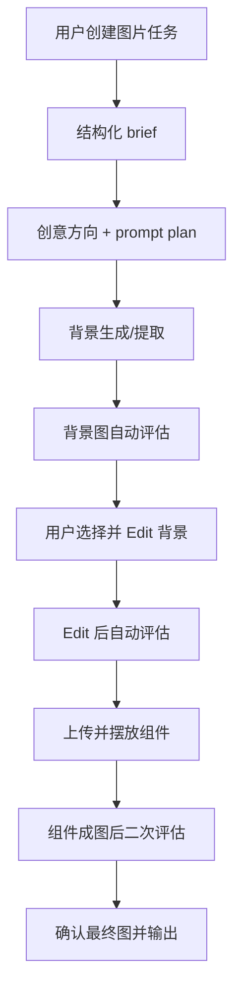

# Production Agent 2.0 Workflow

## 简介
Production Agent 2.0 当前服务于“工作一 / 模式一：稳妥生产模式”。底层 Production Agent 负责背景生成/提取，完整产品闭环由 `interface/app.py` 编排：背景图产出后自动评估，用户可继续 Edit，之后上传组件生成最终商业图并再次评估。

系统核心目标：

1. 将用户业务输入结构化为 task brief 和 prompt plan。
2. 生成或提取可后期使用的背景候选图。
3. 对背景图、Edit 结果、组件成图结果自动评估。
4. 支持组件成图和最终文件输出。

---

## 输入素材

- **背景参考**：用户在 interface 上传成品主图/海报，或用文字描述直接生成背景。
- **组件素材**：v1 先支持用户上传电池体、产品包装、Logo、卖点文案、人物等组件；完整南孚组件素材库选择页后续再接。

---

## 模式一 Workflow

### 1. 用户创建图片任务
用户选择背景生成方式，并填写目标群体、场景、关键用电器、用途、比例、风格、禁忌元素、卖点、目标国家/市场、创意方向数和每方向张数等字段。目标群体和场景从 `南孚内容素材标签建设.csv` 的“人群/场景”标签下拉选择。

输出：
- `RunRequest`
- `task_brief.json`

### 2. 结构化 brief 与创意方向
系统生成 task brief、creative directions 和 prompt plans；高级信息在前端 expander 中展示。

输出：
- `creative_directions.json`
- `prompt_plans.json`

### 3. 背景生成/提取
系统按创意方向调用 Qwen 生成背景，或根据上传成品图提取干净背景。

输出：
- `candidate_*.png`
- `generation_result.json`

### 4. 背景图自动评估
每张候选图自动进入 Evaluation Agent。前端展示 `Excellent / Acceptable / Risky`、主要问题、证据、建议和原始 JSON；`Risky` 只标记为“不推荐”，不物理删除。

输出：
- `background_evaluations.json`
- 每张候选图内嵌 `evaluation`

### 5. Step 6：背景 Edit
用户选择一张候选图作为 Base，填写“需要修改的内容”“保持不变的内容”和“修改强度”。Edit 结果继续自动评估，并回到同一套候选图展示。

输出：
- `edit_generation_result.json`
- `edit_evaluations.json`

### 6. Step 7/8：组件成图与二次评估
用户上传组件并填写组件类型、期望位置、关系描述和是否允许小幅调整角度。系统生成组件成图后，自动执行二次评估。

二次评估重点：
- 电池是否变形
- Logo 是否变形
- 电池正负极是否正确
- 是否误生成其他品牌或伪文字
- 组件是否遮挡关键画面
- 整体是否像商业图
- 是否适合当前用途

输出：
- `component_specs.json`
- `component_generation_result.json`
- `component_evaluations.json`

### 7. Step 9：最终输出
用户选择最终图后可下载 PNG 原图、JPG 压缩版和生产记录 JSON；PSD 分层暂为实验项，高清化继续使用 HD Redraw。

输出：
- PNG 原图
- JPG 压缩版
- `*_provenance.json`

---

## Flowchart

